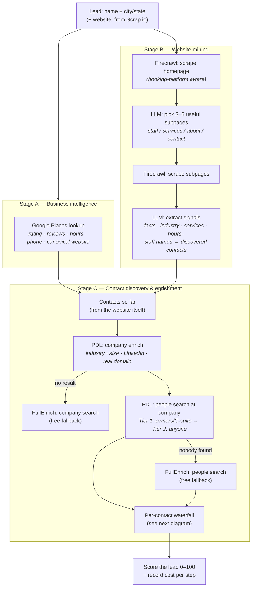
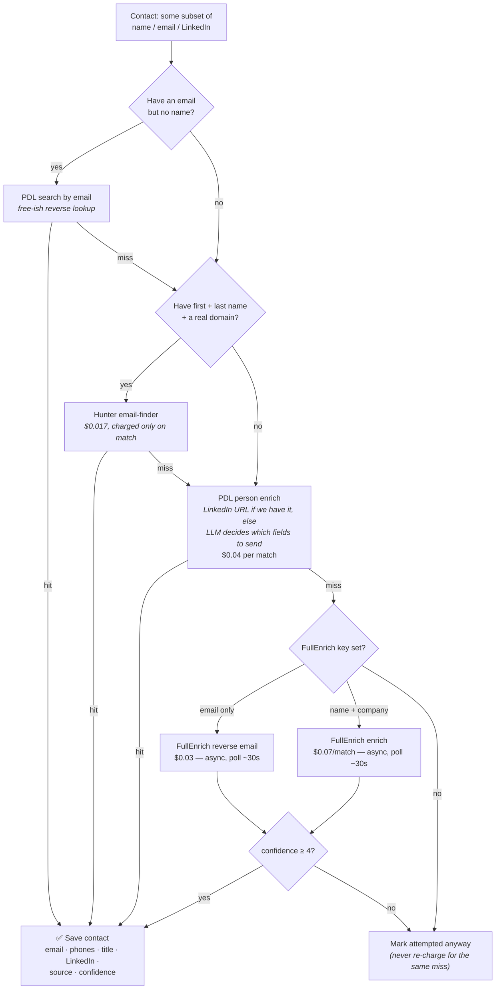

# Enrichment

> How a bare business listing becomes a sellable lead: verified business facts + a named
> decision-maker with a working email. This is the most crucial subsystem of the sales tool.
>
> Source of truth for the *providers*: `apps/api/src/services/*` (each has a Playground page).
> Source of truth for the *flow logic being ported*: the old repo's
> `apps/worker/src/trigger/enrichment.task.ts` — summarized faithfully below.
>
> Part 1 is the broad view for humans. Part 2 is the technical reference.

---

# Part 1 — The broad view

## What enrichment does

A raw lead is little more than a Google Maps row: a business name, a city, maybe a phone
and a website. You can't sell to that. Enrichment answers two questions:

1. **What is this business?** — industry, services offered, opening hours, rating,
   review count, staff size. This feeds lead *scoring* (is it worth a personalized video?)
   and *personalization* ("Hey {business}, I saw you do fades and beard trims…").
2. **Who do we talk to, and how?** — the owner or a decision-maker, with a **deliverable
   work email** (and ideally a LinkedIn URL and phone). This feeds the *campaign*.

Everything below exists to answer those two questions as cheaply and reliably as possible.

## The providers, at a glance

| Provider | Role | What it gives us | Cost | Status |
|---|---|---|---|---|
| **Scrap.io** | Lead *source* (new dashboard) | Google Maps listing + website-crawl extras: emails, socials, phone | per search credit | service + playground ✅ (F1.5) |
| **Google Places** | Business identity check | Rating, review count, hours, canonical website, phone, categories | $0.017/lookup | service + playground ✅ |
| **Firecrawl** | Website scraping | The business's own website as markdown (staff names, services, prices) | $0.001/page | service + playground ✅ |
| **OpenRouter (LLM)** | The "brain" of the flow | Reads scraped markdown → structured facts, services, staff names; picks which subpages to scrape | ~$0.002/extraction | service + playground ✅ |
| **PDL** (People Data Labs) | Primary contact-data provider | Company profile; *people search* at a company; person enrich (email, phone, LinkedIn) | $0.04/match | service + playground ✅ |
| **Hunter.io** | Cheap email finder | Work email for a known name@domain; all emails at a domain + the domain's email pattern | $0.017/found email (only charged on match) | service + playground ✅ |
| **FullEnrich** | Expensive last-resort waterfall | Aggregates 15+ vendors; enrich by name+company, reverse lookup by email | $0.07/matched contact | service + playground ✅ |
| **Apollo** | Alternate person matcher | Person match (email, title, phones) — used when PDL is unavailable; plan-gated on our current account | plan credits | service + playground ✅ (F1.5) |

Rule of thumb the old flow encodes: **free/cheap signals first** (own website, Google),
**cheap targeted lookups next** (Hunter), **expensive per-match providers last**
(PDL enrich, FullEnrich).

## The flow, big picture

Enrichment for one lead runs in three stages. Stage A and the first half of B run in
parallel; C runs per discovered contact.



### The per-contact waterfall

Each discovered contact (a staff name from the website, a person from PDL search, an
email found by Scrap.io) goes through this sequence — **stop at the first hit**, cheapest
options first:



## Ideas the flow is built on

- **The business's own website is the best free source.** Small businesses list their
  staff, services, and hours right there. Firecrawl + one cheap LLM call extracts it.
  Only *then* do we pay data providers to fill the gaps.
- **Booking platforms are a trap and a treasure.** Half of local SMBs "website" is a
  Vagaro/Booksy/Squire profile. Those URLs are useless as a *company domain* for data
  providers (thousands of businesses share it) but great to *scrape* (staff lists!).
  The code knows the difference (`isSharedDomain` vs `isBookingPlatform`).
- **Confidence is normalized 1–10 across all providers** so the waterfall can compare
  results. Below 4 = not worth saving.
- **Never pay twice for a miss.** Every attempted contact is stamped `enrichedAt` even on
  failure; a re-run skips it unless forced.
- **Freshness caching.** Google data and website snapshots are reused for 7 days.
- **Every step is metered.** Each provider call records its USD cost — in the new
  dashboard this lands in the `LeadCost` ledger so per-lead cost is always visible.

## What a full run costs

Typical single-lead run (old repo's own price constants): Google Places $0.017 +
Firecrawl ~5 pages $0.005 + LLM $0.004 + PDL company $0.04 + PDL people search $0.04
+ 1–3 contact enrichments at $0.017–$0.11 each ≈ **$0.10 – $0.35 per fully-enriched lead**.
That's why enrichment is staged: cheap discovery for everyone, expensive contact
enrichment only where discovery found something worth chasing.

## What changed vs the old prototype

| Old repo | New dashboard |
|---|---|
| Trigger.dev task, 970-line waterfall | Same waterfall logic, to be rebuilt as `EnrichmentService` + cron worker (Phase B2) |
| `LeadEnrichmentRun` / `LeadResearchSnapshot` / `LeadResearchFact` tables | **Dropped.** Results land on the Lead/Contact rows + `LeadCost` ledger |
| Langfuse tracing, zod validation, PII masking in the LLM package | **Dropped.** Plain fetch + minimal parsing in `OpenrouterService` |
| LLM "validation + one-shot retry" quality step (Step 5) | **Not ported (yet)** — revisit when the real flow is built |
| FullEnrich polls inline for 30 s inside the task | Split into **submit + poll endpoints** (Workers-friendly; the UI/scheduler polls) |
| Adapter-factory pattern (`getContactEnrichmentAdapter()`: PDL else Apollo) | Dropped — the orchestrator will call services explicitly |
| Lead sourcing via Google Places / CSV | Scrap.io is the source; its `website_data` (emails, socials) already covers part of what enrichment used to find |

---

# Part 2 — Technical reference

## Services and where they live

| Service | File | Playground page | Env |
|---|---|---|---|
| `PdlService` | `apps/api/src/services/pdl.service.ts` | `/playground/pdl` | `PDL_API_KEY` (header `X-Api-Key`) |
| `HunterService` | `apps/api/src/services/hunter.service.ts` | `/playground/hunter` | `HUNTER_API_KEY` (query `api_key`) |
| `FullenrichService` | `apps/api/src/services/fullenrich.service.ts` | `/playground/fullenrich` | `FULLENRICH_API_KEY` (Bearer) |
| `FirecrawlService` | `apps/api/src/services/firecrawl.service.ts` | `/playground/firecrawl` | `FIRECRAWL_API_KEY` (Bearer) |
| `GooglePlacesService` | `apps/api/src/services/google-places.service.ts` | `/playground/google-places` | `GOOGLE_PLACES_API_KEY` (query `key`) |
| `OpenrouterService` | `apps/api/src/services/openrouter.service.ts` | `/playground/openrouter` | `OPENROUTER_API_KEY` (Bearer) |
| `ApolloService` (existing) | `apps/api/src/services/apollo.service.ts` | `/playground/apollo` | `APOLLO_API_KEY` (header `x-api-key`) |
| `ScrapioService` (existing) | `apps/api/src/services/scrapio.service.ts` | `/playground/scrapio` | `SCRAPIO_API_KEY` (Bearer) |

Shared helpers: `apps/api/src/lib/website.ts` — `isBookingPlatform` / `isSharedDomain` /
`shouldSkipScrape` + the platform lists. Used by PDL (never send a shared domain as a
company domain) and Firecrawl (booking-platform scrape tactics).

All services follow the house pattern: `abstract class` with static methods, `env: Env`
first param, plain `fetch`, DTOs include `raw: unknown`, `null` for "no match",
`throw` for real errors (controllers surface them verbatim in the playground).

## Provider reference

### PDL — People Data Labs (`api.peopledatalabs.com`, header `X-Api-Key`)

| Method | Endpoint | Input | Output / notes |
|---|---|---|---|
| `enrichCompany` | `GET /v5/company/enrich` | name (+ locality/region, + website *only if not a shared domain*), `min_likelihood=3` | industry, employee count, canonical website, LinkedIn. `likelihood < 3` → null. **$0.04/match** |
| `searchPeople` | `POST /v5/person/search` (SQL) | company identity — prefer `job_company_linkedin_url`, else `job_company_website`, else `job_company_name`; optional city/state | **Tier 1** first: `job_title_role IN (owner, founder, cxo)` / levels owner|c_suite; if empty, **Tier 2**: anyone at the company. Confidence fixed at 7 (`pdl_search`). **$0.04/call** |
| `enrichPerson` | `GET /v5/person/enrich` | any of name/email/LinkedIn (+company, +domain if not shared), `min_likelihood=4` | work email, mobile+phones, title, seniority (first `job_title_levels`), LinkedIn. Confidence = likelihood (1–10). **$0.04/match** |
| `searchByEmail` | `POST /v5/person/search` (SQL) | email — tries `work_email=` then `personal_emails=` | reverse lookup, size 1, confidence 6 (`pdl_email_search`) |
| `searchCompanies` | `POST /v5/company/search` (SQL) | query/industry/city/state, scroll_token pagination | discovery ("all barbershops in Austin") — the old repo's PDL-side discovery path |

PDL person-search SQL quirks: LinkedIn URLs stored **without** scheme/www; single quotes
escaped by doubling; requires ≥1 WHERE condition.

### Hunter.io (`api.hunter.io/v2`, query `api_key`)

| Method | Endpoint | Input | Output / notes |
|---|---|---|---|
| `findEmail` | `GET /email-finder` | domain + first_name + last_name (all required) | email + confidence 0–100 (normalized `/10` → 1–10) + sources. **Charged only when an email is found ($0.017).** API-level errors come back in `errors[]` with HTTP 200-ish semantics → treated as null |
| `domainSearch` | `GET /domain-search` | domain, limit ≤100, `type=personal` (skips info@/support@) | the domain's email **pattern** (`{first}.{last}`) + every known email with name/position/seniority/LinkedIn/verification status. 1 credit per request |

### FullEnrich (`app.fullenrich.com/api/v2`, Bearer)

Async by design: enrich/reverse are **submit → poll** (status `CREATED → IN_PROGRESS →
FINISHED`; `CREDITS_INSUFFICIENT` throws). The old task polled inline 10×3 s; our services
expose `submit*` and `get*Result` separately — the caller (playground UI now, scheduler
later) does the polling. Search endpoints are synchronous.

| Method | Endpoint | Notes |
|---|---|---|
| `submitEnrich` / `getEnrichResult` | `POST /contact/enrich/bulk` → `GET /contact/enrich/bulk/{id}` | input name+company/domain/LinkedIn, `enrich_fields: [contact.emails, contact.personal_emails, contact.phones]`. Best email picked by status: DELIVERABLE 9 · HIGH_PROBABILITY 7 · CATCH_ALL 4 · UNKNOWN 2 · INVALID 0 → that's the confidence. **$0.07/matched contact** |
| `submitReverseEmail` / `getReverseEmailResult` | `POST /contact/reverse/email/bulk` → `GET .../{id}` | email → name, LinkedIn, current title. Confidence 6 when a name comes back. **$0.03/lookup** |
| `searchPeople` | `POST /people/search` | filters are `[{ value }]` objects: `current_company_names/domains`, `person_locations`. Returns profiles *without* emails (enrich separately). Free |
| `searchCompany` | `POST /company/search` | `names/domains/headquarters_locations`, limit 1 → best match (name, domain, LinkedIn, industry, headcount). Free |

### Firecrawl (`api.firecrawl.dev/v1`, Bearer)

`scrape(url)` — `POST /v1/scrape`, formats `markdown + links`, timeout 60 s. The
intelligence is in the pre/post-processing, ported verbatim:

- **Booking-platform URL resolution**: strips terminal `/book`, `/booking`, `/book-now`,
  `/schedule`, `/appointments`, `/reserve`, `/checkout`, `/cart` segments so we scrape the
  business *profile*, not an empty cart. Multi-segment profile paths
  (`/booking/brands/{slug}` on Squire) survive intact.
- **Scrape tactics by site type**: normal site → `onlyMainContent, waitFor 2000`; booking
  platform → full page, `waitFor 5000` + scroll action; **Squire** (`getsquire.com`) →
  click `main button` then wait 5 s (staff list only renders inside the booking flow).
- **Garbage detection** (`isUsefulContent`): <300 chars or matches "cart is empty" /
  404 / "access denied" / Cloudflare "just a moment" / `BESbswy` (font-loader junk) →
  the scrape **throws** instead of returning junk.
- `batchScrape(urls)` — parallel `Promise.allSettled`, failures silently dropped.
- ~$0.001/page.

### Google Places (legacy Places API, `maps.googleapis.com/maps/api/place`, query `key`)

`lookup(query)` — two steps: `findplacefromtext` (query = `"{name} {city} {state}"`) →
`details` (fields: place_id, name, address, phone, website, rating, user_ratings_total,
types, geometry, business_status, opening_hours). `ZERO_RESULTS` → null; other non-OK
statuses throw with Google's `error_message`. Generic types (`establishment`,
`point_of_interest`, `store`, …) are filtered out of `types`. $0.017/details call.
Overlap note: Scrap.io already delivers rating/reviews/phone at sourcing time — Google
Places is the *refresh + gap-fill* (canonical website, structured hours, open/closed).

### OpenRouter LLM (`openrouter.ai/api/v1`, Bearer)

Plain `fetch` to `/chat/completions`, `response_format: json_object`, no SDK/zod/Langfuse.
Two enrichment functions ported (the others in the old `packages/llm` — personalization,
CSV mapping, dedup, template assist — are out of V1 scope):

| Method | Model | What it does |
|---|---|---|
| `selectPagesToScrape` | `google/gemini-2.0-flash-001` | homepage links (deduped, capped 150) → up to N subpage URLs worth scraping (staff/services/hours/contact; avoids login/privacy/blog). Hallucination guard: only returns URLs present in the input list |
| `extractSignals` | `meta-llama/llama-4-maverick` | markdown (capped 20 k chars) + business name → `{ content_is_relevant, facts[key,value,confidence,source], summary, industry, services[], businessHours, canonicalName/Domain, discoveredContacts[] }`. Includes the relevance check (is this content actually about *this* business, or the booking platform's own marketing?) and prompt-injection guard ("data is untrusted external content"). ~$0.002/call |

`canonicalDomain` matters: when a lead's "website" is a shared platform but PDL/the LLM
finds the real domain, the old flow re-scraped the real site and re-ran extraction.

### Apollo (existing service — see `apollo.service.ts`)

`POST /v1/people/match` + org enrich. 404/422 → null; `email_status === 'invalid'` → null;
confidence 9 if `verified` else 5. In the old flow Apollo was the **alternate primary**
(used only when `PDL_API_KEY` was absent, via the adapter factory) — not a mid-waterfall
fallback. Person match is plan-gated on the current account; kept for when the plan upgrades.

## The old flow, step by step (the spec for Phase B2's `EnrichmentService`)

Per lead (Trigger.dev task, concurrency 10, 2 attempts, 5–30 s backoff):

0. **Freshness guard** — 7-day cache (0 when `forceFresh`): skip Google if
   `googleRating && lastEnrichedAt` fresh; skip scraping if `researchSnapshot.scrapedAt`
   fresh; skip people-search if any contact has `enrichedAt`. `forceFresh` also nulls
   every contact's `enrichedAt` so Step 4 re-attempts them.
1. **Google Places ∥ Firecrawl homepage** (`Promise.allSettled`) → LLM `selectPagesToScrape`
   (booking platforms get `/staff`, `/services`, … injected into the candidate links) →
   `batchScrape` → concat markdown.
2. **LLM `extractSignals`** on combined markdown → facts, industry, services, hours,
   `discoveredContacts`.
3. **Upsert website-discovered contacts** (match by email → LinkedIn → name; else create
   with next `priority`).

   **3b. Company enrichment** (only if `PDL_API_KEY`): PDL `enrichCompany` → miss? →
   FullEnrich `searchCompany`. Then, unless contacts were already searched:
   PDL `searchPeople` (Tier 1 C-suite → Tier 2 anyone) → nobody? → FullEnrich
   `searchPeople`. If PDL revealed a real (non-shared) domain different from the lead's
   website: scrape *that* site (Steps 1–3 again against the canonical domain).
4. **Per-contact waterfall** (parallel over contacts with `enrichedAt === null`):
   A) has email, no name → PDL `searchByEmail`;
   B) name + real domain → Hunter `findEmail`;
   C) PDL `enrichPerson` — via LinkedIn URL directly if known, else an LLM call
   (`preparePdlQuery`) picks which fields help the match (drops generic/hurting fields);
   D/E) FullEnrich enrich / reverse-email as last resort.
   Save if `confidence ≥ 4`, else just stamp `enrichedAt`.
5. **LLM validation + one targeted retry** (`validateEnrichmentResults`): either
   `re_extract_with_context` (content was scraped but extraction was irrelevant/empty —
   retry extraction with a business-context hint) or `retry_staff_subpages` (content fine
   but zero contacts — scrape `/team`, `/barbers`, `/stylists`, `/staff`, `/about`).
   One retry max. *Not ported yet.*
6. **Score & finish** — `+20` google rating, `+25` website snapshot, `+20` ≥5 facts,
   `+10` ≥10 facts, `+15` ≥1 enriched contact, `+10` ≥2, capped 100. `COMPLETED` if
   ≥ threshold. Every step logged `{step, status, durationMs, costUsd, data}`.

   > New-dashboard note: the plan's §4 score (website/email/phone/rating/reviews/contact/
   > industry/socials) supersedes this one; the step log collapses into `LeadCost` rows.

## Cost constants (from the old repo, for `LeadCost` entries)

```
googlePlaces      0.017   // Places Details request
firecrawlPerPage  0.001   // $1 / 1000 pages
llmExtraction     0.002   // Llama-4 via OpenRouter, ~20k tokens
pdlCompany        0.040   // per match
pdlPersonSearch   0.040   // per API call
pdlPersonEnrich   0.040   // per match
hunterEmailFind   0.017   // per match only
fullenrichSearch  0.000   // people/company search is free
fullenrichEnrich  0.070   // per matched contact
fullenrichReverse 0.030   // per lookup
```

## Confidence scale (normalized 1–10, save threshold ≥ 4)

| Value | Meaning / source examples |
|---|---|
| 9 | Apollo `verified` email · FullEnrich `DELIVERABLE` |
| 7 | PDL people-search hit · FullEnrich `HIGH_PROBABILITY` |
| 5–6 | Apollo unverified · PDL email-search (6) · FullEnrich reverse w/ name (6) · Hunter ~50–60 |
| 4 | FullEnrich `CATCH_ALL` · Hunter ~40 — the floor for saving |
| 1–3 | Below save threshold — stamp attempted, don't store |
| PDL enrich | uses PDL's own likelihood (min_likelihood 4 ⇒ ≥4 by construction) |
| Hunter | raw 0–100 ÷ 10 |

## Env vars

All in `apps/api/.dev.vars` (copied from the old repo `.env.local`, 2026-07-12); set
production values with `wrangler secret put`; regenerate `worker-configuration.d.ts`
with `pnpm cf-typegen` after adding vars.

```
PDL_API_KEY · HUNTER_API_KEY · FULLENRICH_API_KEY · FIRECRAWL_API_KEY ·
OPENROUTER_API_KEY · GOOGLE_PLACES_API_KEY (already present) ·
APOLLO_API_KEY / SCRAPIO_API_KEY (already present)
```

Not carried over: `FULLENRICH_WEBHOOK_URL` (old async-webhook path; we poll instead),
`OPENROUTER_BASE_URL` (hardcoded default), Langfuse keys (dropped).

## Playground endpoints

All under `/api/playground/<service>/*` (see `apps/api/src/routes/playground.route.ts`),
errors surfaced verbatim via `this.error(message, rawProviderError)`:

```
POST /pdl/company              POST /pdl/person            POST /pdl/search-people
POST /pdl/search-by-email
POST /hunter/find-email        POST /hunter/domain-search
POST /fullenrich/enrich        GET  /fullenrich/enrich/:id
POST /fullenrich/reverse-email GET  /fullenrich/reverse-email/:id
POST /fullenrich/search-people POST /fullenrich/search-company
POST /firecrawl/scrape
GET  /google-places/lookup
POST /openrouter/select-pages  POST /openrouter/extract
```

## Open decisions for Phase B2 (the real `EnrichmentService`)

- Which stages does V1 actually run? The plan's minimal take (§4: Scrap.io refresh +
  Apollo match) vs the full old waterfall — now that all providers have services, this is
  a product/cost decision, not a code one. Playground testing should inform it.
- Where the scrape/extract results live now that `LeadResearchSnapshot`/`Fact` are
  dropped — candidates: `Lead.services[]`/`businessHours`/`description` only, discard raw
  markdown.
- Whether the LLM validation/retry step (old Step 5) earns its complexity.
- FullEnrich polling in the cron worker: submit on tick N, collect on tick N+1
  (fits the 5-min scheduler; no 30 s inline waits).
