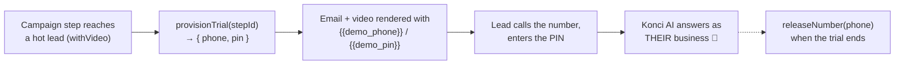

# Telephony (Jambonz)

> **REMOVED FROM THE APP 2026-07-24** — the Jambonz service + playground were deleted
> (demo lines come from the Konci platform registration pipeline instead). This doc is
> kept as background reference on how the phone infrastructure works.

> How a hot lead gets a **demo phone number + PIN** so they can call and hear *their own*
> AI receptionist. Ported from the old repo's `packages/telephony` — much smaller than
> enrichment, but it touches Konci's real production phone infrastructure, so read the
> "what's verified vs not" section before pressing buttons.
>
> Part 1 is the broad view. Part 2 is the technical reference.

---

# Part 1 — The broad view

## Why the sales tool touches telephony at all

Konci's product *is* an AI phone operator. The single most convincing demo is:
**"Call this number, enter this PIN — that's your business's AI receptionist."**
So the outreach email/video for a hot lead includes a `{{demo_phone}}` and `{{demo_pin}}`.
Somebody has to allocate that number and PIN — that's this integration.

## Where the phone numbers come from

Konci runs its own [Jambonz](https://jambonz.org) server (open-source voice platform) at
`api.us-east.hackhouse.io`. Verified live (2026-07-12, read-only): the account **"Konci"**
is active, owns a **pool of real US phone numbers**, and each number is routed to a
Jambonz **application** — the actual Konci AI agents ("Konci AI Agent - Production",
various dev/test agents). This is the production infrastructure of the product itself,
not a sandbox. Treat provisioning with respect.

## How the old prototype used it



**Reality check:** the old repo *never turned this on*. `TELEPHONY_PROVIDER=mock` to this
day, `JAMBONZ_APPLICATION_SID=[TODO]` in its env, and every run used the mock adapter
(fixed fake number `+18005551234`, deterministic PIN). The Jambonz adapter's two custom
endpoints (`/v1/trial/provision`, `/v1/trial/release`) have therefore **never been
exercised by the pipeline** — see status below.

## Status (live-tested 2026-07-12)

| Call | Status | Notes |
|---|---|---|
| Account info, number pool, application list | ✅ verified | standard Jambonz REST API, read-only, free |
| `POST /v1/trial/provision` / `POST /v1/trial/release` | ❓ untested | custom (non-standard) endpoints the old adapter expected on the Jambonz server. Deliberately NOT auto-tested — a successful provision takes a real number from the production pool. Use the playground's provision button intentionally, then release. If they 404, the server-side endpoint was never built and provisioning needs a conversation with whoever runs the Jambonz box. |

## What we did / didn't port

| Old repo | New dashboard |
|---|---|
| `ITelephonyAdapter` + adapter factory (mock/jambonz via `TELEPHONY_PROVIDER`) | Dropped — one `JambonzService`, no factory, no provider env |
| Mock adapter (fake number for automated workflow runs) | Dropped — V1 enters demo phone/PIN **manually on the Lead** (plan §9.2); nothing automated needs a fake number |
| Jambonz adapter (`provisionTrial`, `releaseNumber`) | Ported as-is into `JambonzService` (+ PIN generated app-side, same as old) |
| — | Added read-only `listNumbers` / `listApplications` (verified working) so the pool is visible in the playground |
| `TrialPhoneNumber` / `TrialSession` tables | Still dropped (plan §3) — demo phone/PIN live on the Lead row |

---

# Part 2 — Technical reference

## Service

`apps/api/src/services/jambonz.service.ts` — house pattern (abstract class, static
methods, `env` first param, plain fetch, `raw` in DTOs). Playground: `/playground/jambonz`,
endpoints under `/api/playground/jambonz/*`.

**Base URL:** `env.JAMBONZ_API_URL` (`https://api.us-east.hackhouse.io`)
**Auth:** `Authorization: Bearer <JAMBONZ_API_KEY>`

| Method | Endpoint | Verified | Notes |
|---|---|---|---|
| `listNumbers` | `GET /v1/PhoneNumbers` | ✅ | the account's number pool: number, sid, carrier, bound application |
| `listApplications` | `GET /v1/Accounts/{JAMBONZ_ACCOUNT_SID}/Applications` | ✅ | the AI agents; used to show which app each number routes to |
| `provisionTrial` | `POST /v1/trial/provision` `{ workflowRunStepId, pin }` → `{ phone }` | ❓ | custom endpoint; PIN is generated by *us* (6 digits) and sent in the request. `workflowRunStepId` is just a reference string — we pass a lead/test reference |
| `releaseNumber` | `POST /v1/trial/release` `{ phone }` | ❓ | returns the number to the pool |

## Env vars (in `apps/api/.dev.vars`, from old repo `.env.local` 2026-07-12)

```
JAMBONZ_API_URL      https://api.us-east.hackhouse.io
JAMBONZ_API_KEY      (Bearer)
JAMBONZ_ACCOUNT_SID  needed for the Applications route
```

Present in the old env but **not carried over** (not used by any call we make):
`JAMBONZ_WEBHOOK_SECRET` (call-event webhooks — relevant only when we track demo calls),
`JAMBONZ_VOIP_CARRIER_SID`, `JAMBONZ_APPLICATION_SID` (was `[TODO]` — never set),
`TELEPHONY_PROVIDER` (mock/jambonz switch — dropped with the mock).

Side note (corrects plan §6): the old env's `KONCI_SERVICE_TOKEN` + `API_BASE_URL` point
at the old repo's **own** API (`sales-api.konci.ai`) — service-to-service auth for itself,
not a separate Konci platform API. The "Konci platform API" for telephony is, as far as
the old code shows, exactly this Jambonz server.

## Playground endpoints

```
GET  /api/playground/jambonz/numbers        — pool + bound app names (safe, free)
GET  /api/playground/jambonz/applications   — AI agent apps (safe, free)
POST /api/playground/jambonz/provision      — ⚠️ takes a REAL number from the pool
POST /api/playground/jambonz/release        — returns it
```

## Call-event webhook (for later)

The old repo also had `apps/api/src/webhooks/jambonz.controller.ts`: Jambonz posts call
events, verified with HMAC-SHA256 over the raw body (`x-jambonz-signature`, timing-safe
compare, secret = the API key) and used to record `callCount` / `firstCallAt` per trial.
Not ported — becomes relevant when we track "lead actually called their demo".

## V1 integration plan

Per plan §9.2, demo phone/PIN are **manual fields on the Lead** in V1 — a salesperson
types them in. This service exists so that (a) the pool is visible and testable now, and
(b) when auto-provisioning is wanted (campaign scheduler step: `withVideo` lead →
provision → render `{{demo_phone}}`/`{{demo_pin}}` → release on trial end), the calls are
already wrapped and validated. Open before automating: confirm `/v1/trial/*` exists
server-side, decide PIN → agent-config wiring (how does the Konci agent know which
business a PIN maps to?), and number-release policy (after N days? on CLOSED_* status?).
